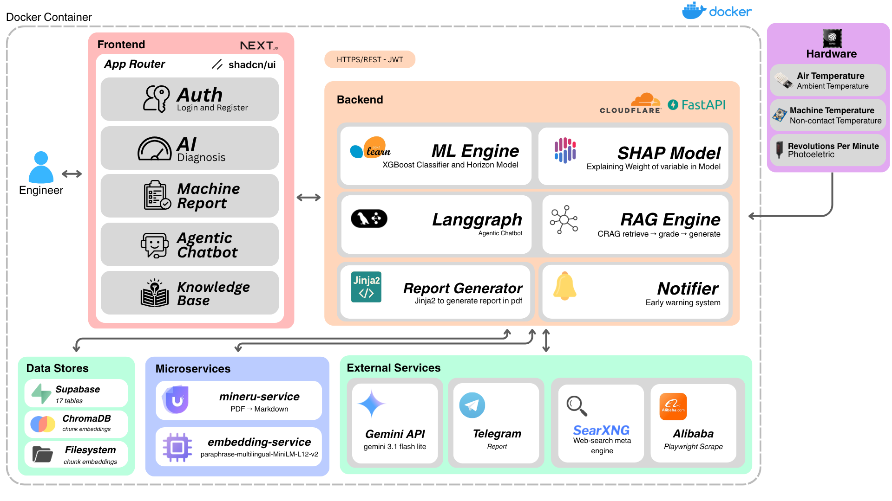
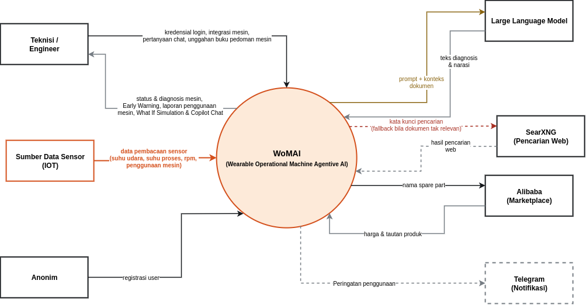
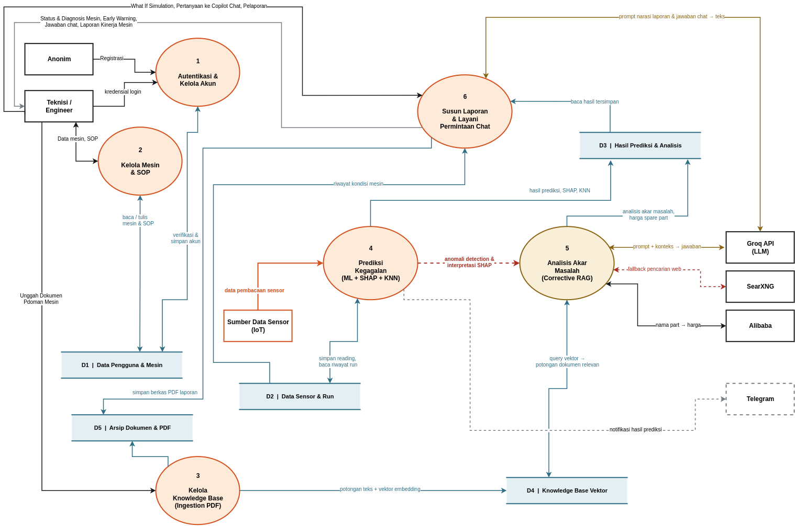
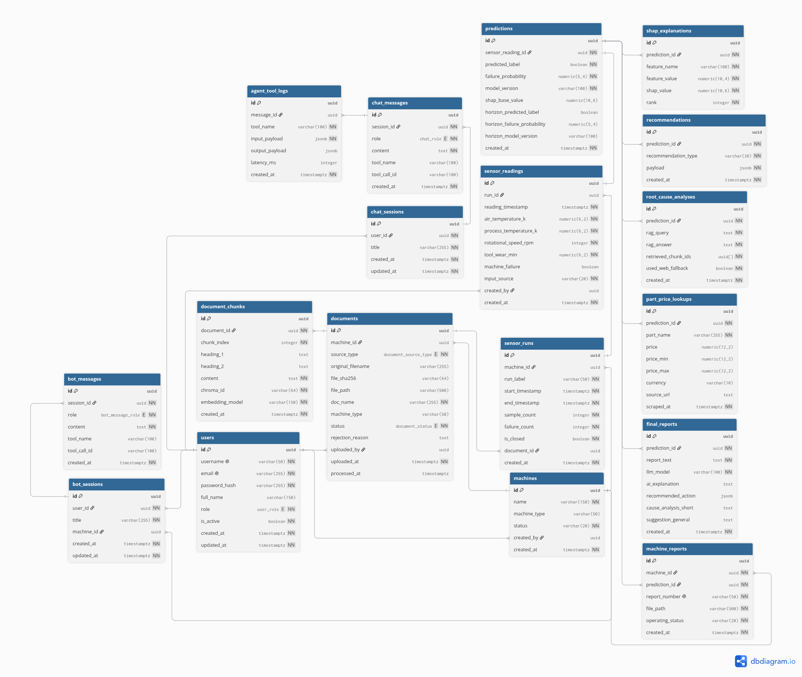

# Predictive Maintenance Copilot


Aplikasi predictive maintenance untuk mesin Milling yang menggabungkan **prediksi kegagalan berbasis Machine Learning** (dua model: klasifikasi gagal/tidak, dan prediksi risiko dalam 10 menit ke depan), **penjelasan model (SHAP)**, **rekomendasi berbasis kemiripan kasus (KNN)**, dan **analisis akar masalah otomatis (Corrective RAG + LLM)**, lengkap dengan estimasi harga spare part dari marketplace dan laporan PDF otomatis.

Sistem membaca data sensor mesin, memprediksi risiko kegagalan (sekarang dan 10 menit ke depan), menjelaskan *mengapa* lewat kartu **Early Warning**, menyarankan penyesuaian parameter, mencari SOP penanganan dari manual servis (atau pencarian web sebagai fallback), menghasilkan **laporan PDF** otomatis setiap ada data sensor baru, dan menyediakan **chatbot** untuk bertanya soal prediksi, laporan, SOP, maupun menjalankan simulasi **"bagaimana jika"** (what-if) terhadap kondisi mesin.

Seluruh keluaran LLM (jawaban RAG, laporan PDF, diagnosis) berbahasa **Inggris**, wajib menyertakan **sitasi sumber** (nama dokumen tanpa ekstensi file), dan dilarang memakai kalimat ambigu seperti "maybe" atau "perhaps". Pernyataan harus tegas dan berdasarkan bukti.

## Daftar Isi

- [Arsitektur & Tech Stack](#arsitektur--tech-stack)
- [Diagram](#diagram)
- [Struktur Proyek](#struktur-proyek)
- [Alur Kerja Utama](#alur-kerja-utama-pipeline-report)
- [Fitur & Halaman Frontend](#fitur--halaman-frontend)
- [Menjalankan Aplikasi](#menjalankan-aplikasi)
- [Dokumentasi API](#dokumentasi-api)
- [Skema Database](#skema-database-inti)
- [Model Machine Learning](#model-machine-learning)
- [Status Pengerjaan](#status-pengerjaan)

## Arsitektur & Tech Stack

| Layer | Teknologi |
|---|---|
| Frontend | Next.js 16 (App Router, TypeScript), Tailwind CSS v4, shadcn/ui (base-ui), Bun. Pola BFF: backend dipanggil hanya lewat Server Actions/Route Handlers, browser tidak pernah memanggil backend langsung |
| Backend | FastAPI (Python), SQLAlchemy 2.0, Alembic |
| Database | PostgreSQL 16 (data relasional) + ChromaDB (vector store, 2 collection: dokumen & auto-chunk sensor run) |
| ML | XGBoost (2 model terpisah: klasifikasi & horizon), SHAP, KNN (NearestNeighbors), deteksi outlier IQR per-run |
| RAG / LLM | LangGraph (Corrective RAG), Groq (LLM inference) |
| Parsing dokumen | MinerU (PDF → Markdown, OCR/layout), berjalan sebagai **service Docker terpisah** (`mineru-service`), dipanggil backend lewat HTTP client kustom ringan (`backend/vendor/mineru_client.py`) alih-alih diimpor langsung sebagai library Python di dalam image backend |
| Embedding | sentence-transformers, juga berjalan sebagai **service Docker terpisah** (`embedding-service`), dipanggil backend lewat HTTP |
| Laporan PDF | WeasyPrint + Jinja2 (`backend/app/reports/`), generate otomatis setiap ada data sensor baru |
| Pencarian web | SearXNG (self-hosted metasearch), dipakai CRAG sebagai fallback saat dokumen knowledgebase tidak relevan |
| Harga part | Scraping Alibaba langsung via Playwright (Chromium) di dalam proses backend, **bukan** lewat Firecrawl (dihapus total) |
| Auth | JWT (python-jose) + bcrypt (passlib), role-based access control hierarkis. `JWT_SECRET` **di-random ulang setiap backend restart** (lihat [Menjalankan Aplikasi](#menjalankan-aplikasi)), memaksa semua sesi login logout otomatis setelah restart |
| Orkestrasi | Docker Compose (`compose.yaml` base + `dev.compose.yaml`/`prod.compose.yaml` override), 7 service total |

> **Catatan migrasi Firecrawl → Playwright.** Endpoint pencarian Alibaba duduk di belakang Akamai Bot Manager yang mem-fingerprint TLS/JA3, bukan cuma header HTTP, sehingga client HTTP biasa (termasuk Firecrawl) selalu terblokir cepat atau lambat. Solusinya: Playwright menjalankan Chromium sungguhan langsung di proses backend (`app/rag/part_price_search.py`), tanpa service terpisah. Saat ini **hanya Alibaba** yang di-scrape langsung dengan cara ini, keputusan sadar untuk cakupan sempit tapi reliable, daripada Playwright dipakai untuk banyak situs dengan struktur berbeda-beda.

> **Catatan migrasi MinerU & embedding ke service terpisah.** Sebelumnya, model MinerU (parsing PDF) dan sentence-transformers (embedding) di-load langsung di proses backend. Setiap perubahan kecil di kode backend (`requirements.txt` atau file Python apa pun) membuat Docker meng-invalidate ulang layer cache yang berisi download model berukuran ratusan MB, membuat rebuild jadi sangat lambat. Kedua model itu sekarang berjalan sebagai container Docker sendiri (`mineru-service`, `embedding-service`) dengan volume cache sendiri, dipanggil backend murni lewat HTTP. Perubahan kode backend tidak lagi memicu re-download model.

## Diagram

**Arsitektur Sistem**: komponen frontend/backend di dalam Docker, data store (Supabase, ChromaDB, filesystem), microservices (`mineru-service`, `embedding-service`), layanan eksternal (Gemini, Telegram, SearXNG, Alibaba), dan sumber data hardware (IoT).



**Data Flow Diagram, Level 0 (Context Diagram)**: WoMAI sebagai satu proses tunggal, beserta seluruh entitas eksternal yang berinteraksi dengannya.



**Data Flow Diagram, Level 1**: dekomposisi WoMAI jadi 6 sub-proses (autentikasi, kelola mesin/SOP, kelola knowledge base, prediksi kegagalan, analisis akar masalah/CRAG, susun laporan & layani chat) beserta data store-nya.



**Entity Relationship Diagram**: skema lengkap seluruh tabel Postgres dan relasinya.



## Struktur Proyek

<details>
<summary>Lihat pohon direktori lengkap</summary>

```
comfest/app/
├── backend/                           # FastAPI app
│   ├── app/
│   │   ├── api/                       # Route handlers: auth, machine, sensor, knowledgebase,
│   │   │                              #   report, machine_report, sop, chat
│   │   ├── db/                        # SQLAlchemy models, session, migrasi Alembic
│   │   ├── ingestion/                 # Parsing PDF (via mineru_client), chunking, deduplikasi,
│   │   │                              #   embedding (via HTTP ke embedding-service)
│   │   ├── llm/                       # Klien Groq (chat/chat_json)
│   │   ├── ml/                        # Prediktor klasifikasi + horizon, SHAP, KNN, outlier IQR
│   │   ├── rag/                       # Corrective RAG graph, retriever, grader, final_report
│   │   │                              #   (LLM), part_price_search (Playwright → Alibaba)
│   │   ├── reports/                   # Generator laporan PDF: template Jinja2, narasi LLM,
│   │   │                              #   penataan folder laporan per hari
│   │   ├── schemas/                   # Pydantic request/response models
│   │   ├── vectorstore/               # Klien ChromaDB
│   │   ├── config.py                  # Konfigurasi (env vars)
│   │   └── main.py                    # Entry point FastAPI
│   ├── saved/                         # Model ML terlatih: clasification/, horizon/ (masing-
│   │                                  #   masing .pkl + catatan cara pakai)
│   ├── vendor/                        # Klien HTTP MinerU kustom (mineru_client.py); TIDAK
│   │                                  #   mengimpor package `mineru` langsung, hanya replikasi
│   │                                  #   protokol submit/poll/download-nya lewat httpx
│   └── Dockerfile.dev / Dockerfile.prod
├── mineru-service/                    # Container terpisah: menjalankan MinerU asli (mineru-api)
├── embedding-service/                 # Container terpisah: FastAPI wrapper sentence-transformers
├── frontend/                          # Next.js App Router
│   └── src/
│       ├── app/
│       │   ├── (app)/                 # Halaman berautentikasi: mesin, chat, chat/[id], sop,
│       │   │                          #   riwayat, machine-diagnosis, machine-report
│       │   ├── actions/               # Server Actions: satu-satunya jalur ke backend FastAPI
│       │   ├── api/chat/route.ts      # Proxy SSE dari POST /chat backend
│       │   ├── api/machine-report/[id]/pdf/route.ts   # Proxy stream PDF laporan (inline, bukan
│       │   │                                          #   download paksa)
│       │   ├── login/, register/      # Auth pages
│       │   └── page.tsx               # Landing page (marketing)
│       ├── components/                # UI (shadcn/ui) + komponen chat + app-shell/sidebar +
│       │                              #   require-active-machine (gerbang pemilihan mesin)
│       ├── hooks/, lib/               # Hooks, tipe, util, sesi auth (cookie), state mesin
│       │                              #    aktif (localStorage)
│       └── middleware.ts              # Cek keberadaan cookie sesi + redirect paksa ke /mesin
├── searxng/                           # Konfigurasi SearXNG
├── compose.yaml                       # Service dasar: postgres, chromadb, searxng
├── dev.compose.yaml                   # Override dev: 7 service, hot-reload, port host
├── prod.compose.yaml                  # Override prod: build image, Traefik/Dokploy routing
└── up.sh                              # Wrapper `docker compose up` dengan health-check banner
```

</details>

## Alur Kerja Utama (Pipeline Report)

Ketika sebuah **sensor reading** masuk (`POST /sensor/readings`), backend secara sinkron menjalankan pipeline penuh berikut sebelum merespons. Tidak ada job queue asinkron.

1. **Assign run**: reading dikelompokkan ke sebuah "run" per mesin (berdasarkan `tool_wear_min` yang naik monoton; turun = run baru dimulai).
2. **Prediksi kegagalan (model klasifikasi)**: 4 fitur mentah sensor diubah jadi 9 fitur (5 fitur turunan berbasis fisika: selisih/rasio suhu, interaksi keausan×rpm, laju margin pendinginan, beban keausan termal), diprediksi model **XGBoost** memakai `threshold` hasil tuning (bukan 0.5 baku).
3. **Prediksi horizon (+10 menit)**: model **XGBoost terpisah**, hanya memakai 4 fitur mentah tanpa fitur turunan, menjawab pertanyaan berbeda: "apakah mesin akan gagal dalam 10 menit ke depan?". Kegagalan model ini tidak menggagalkan pipeline utama (hasil nullable).
4. **SHAP**: menjelaskan kontribusi tiap fitur mentah terhadap probabilitas kegagalan (model klasifikasi).
5. **KNN**: mencari kasus historis termirip (gagal & tidak gagal) serta menghitung "worst-case delta" (penyesuaian parameter menuju titik aman terdekat).
6. **Deteksi anomali (IQR per run)**: batas normal tiap parameter dihitung dari data run mesin yang sedang berjalan (bukan batas statis global), dipakai untuk kartu Early Warning dan untuk memutuskan fitur mana yang "benar-benar anomali" saat menyusun query CRAG.
7. **Narasi Early Warning**: LLM menulis penjelasan singkat ("AI Diagnosis") + alasan/dampak dari rekomendasi penyesuaian ("Recommended Action"). Angka rekomendasi dihitung deterministik di Python dari hasil worst-case delta, LLM hanya menulis prosanya. Berjalan untuk **setiap** hasil, baik gagal maupun normal.
8. **Corrective RAG (CRAG)**, *hanya jika diprediksi gagal*: query dibangun dari interpretasi SHAP + fitur yang anomali, dokumen manual servis di-retrieve dari ChromaDB (multi-query), di-grade relevansinya oleh LLM (Groq); jika <50% dokumen relevan, fallback ke pencarian web (SearXNG). LLM menyusun jawaban 3 bagian berbahasa Inggris (**What Is the Problem / Handling Procedure / Affected Part / Component**), setiap klaim wajib disitasi dengan nama sumber (tanpa ekstensi file), tanpa kalimat ambigu. Di akhir jawaban, LLM menuliskan baris tersembunyi `PART_NAMES: <part 1>, <part 2>, ...` berisi **semua** part/consumable yang disebut perlu diganti/diservis (dipakai tabel biaya, lihat langkah berikut).
9. **Pencarian harga part**: untuk **setiap** nama part di `PART_NAMES`, dicari 1 produk representatif di Alibaba (Playwright), harga & link disimpan. Ada penjaga relevansi sederhana (kecocokan kata kunci) untuk menolak hasil yang sama sekali tidak nyambung dengan nama part yang dicari.
10. **Laporan akhir (teks)**: LLM menyusun ringkasan markdown berbahasa Inggris dari seluruh hasil di atas (dipakai chatbot & `GET /report/latest`).
11. **Laporan PDF (Machine Report)**: dibangkitkan otomatis sekali per reading (lihat [bagian Machine Report](#machine-report-pdf) di bawah), disimpan ke disk dan dicatat di tabel `machine_reports`.

Seluruh hasil pipeline disimpan ke database. `GET /report/latest` dan `GET /machine-report/*` **tidak** menghitung ulang apa pun, murni membaca hasil yang sudah tersimpan, sehingga cepat dan idempoten terhadap pemanggilan berulang dari frontend.

**Chatbot (`POST /chat`)** memakai router intent sederhana (satu panggilan LLM mengekstrak intent + parameter dari pesan user, bukan native tool-calling) dan mem-*bypass* sebagian pipeline di atas untuk kasus tertentu:
- `predict`: user menyebutkan nilai sensor baru, dijalankan sungguhan lewat pipeline di atas (data tersimpan).
- `latest_report`: membaca `GET /report/latest` yang sudah ada.
- `sop_lookup`: mencocokkan SOP paling relevan dari knowledge base.
- `what_if`: simulasi hipotetis. Nilai sensor yang tidak disebut user memakai pembacaan sungguhan terakhir mesin itu sebagai baseline, prediksi + SHAP dijalankan **murni in-memory** (tidak ada baris `sensor_readings`/`sensor_runs`/`predictions` yang ditulis), lalu LLM membandingkan hasil hipotetis terhadap prediksi nyata terakhir mesin tersebut.
- `chitchat`: jawaban umum.

`machine_id` yang aktif di frontend (state mesin yang dipilih user, lihat [Fitur & Halaman Frontend](#fitur--halaman-frontend)) selalu dipakai untuk chat, mengalahkan mesin apa pun yang mungkin disebut LLM dari teks bebas user.

### Machine Report (PDF)

Setiap kali data sensor baru masuk, backend otomatis membangkitkan satu file **PDF laporan kondisi mesin** (`backend/app/reports/`, dirender dengan WeasyPrint dari template Jinja2), disimpan di `{REPORTS_DIR}/{machine_id}/{tanggal}/{nomor_laporan}.pdf` dengan format nomor `RPT-YYYYMMDD-NNN` (urutan harian global, bukan per mesin). Prinsip desainnya: **semua angka dihitung deterministik** dari hasil pipeline/database, LLM hanya menulis prosa penjelas, supaya laporan formal ini tetap bisa dipercaya angkanya.

Struktur laporan:
1. **Report Information**: identitas laporan & status operasional (Normal/Warning/Failure).
2. **Average Machine Condition**: snapshot parameter sensor, health score, dan **probabilitas gagal dalam +10 menit** (dari model horizon), plus ringkasan kondisi dari LLM.
3. **Failure Risk Prediction** (satu section gabungan): hasil prediksi & risk level, tabel **Feature Contribution** (skor kontribusi tiap fitur dinormalisasi 0–100, bukan nilai SHAP mentah), diagnosis LLM, dan tabel **Machine Parts Checking** (satu baris per part yang disebut CRAG perlu diperiksa/diganti).
4. **Handling in Accordance with Standard Operating Procedures**: jawaban CRAG dipecah jadi 3 subsection HTML asli (What Is the Problem / Handling Procedure / Affected Part / Component), bukan dump markdown mentah.
5. **Estimated Machine Part Cost**: satu baris harga per part di Machine Parts Checking (dicari terpisah ke Alibaba per part), plus baris **Total Estimated Cost**.
6. **Machine Condition Log**: riwayat 10 pembacaan terakhir mesin tersebut.
7. **Summary**: penutup dari LLM, tepat 2 paragraf × 4 kalimat.

Section **Estimated Financial Impact** (biaya downtime, dsb.) sengaja **tidak** diimplementasikan. Tidak ada sumber data biaya per jam/tingkat produksi di sistem ini, dan mengarang angka di laporan formal lebih buruk daripada tidak menampilkannya sama sekali.

## Fitur & Halaman Frontend

Semua halaman di bawah `(app)/` mensyaratkan login **dan** pemilihan mesin aktif terlebih dahulu, lihat [Gerbang Pemilihan Mesin](#gerbang-pemilihan-mesin-active-machine-gating) di bawah.

| Halaman | Fungsi & manfaat |
|---|---|
| `/` | Landing page publik (marketing). |
| `/login`, `/register` | Autentikasi. Setiap kali halaman login dimuat, state mesin aktif di browser otomatis dibersihkan, mencakup logout manual, sesi kedaluwarsa, maupun invalidasi akibat restart backend, tanpa perlu membedakan penyebabnya. |
| `/mesin` | **Selalu jadi halaman pertama** setelah login: daftar & CRUD mesin. Memilih/klik sebuah mesin di sini menetapkannya sebagai "mesin aktif" dan baru setelah itu sidebar serta menu lain muncul. |
| `/machine-diagnosis` | Dashboard diagnosis real-time untuk mesin aktif: kartu prediksi (risiko gagal sekarang + proyeksi 10 menit ke depan), grid Early Warning per parameter, kartu AI Diagnosis (faktor penyebab utama), dan kartu AI Explanation (delta KNN, ringkasan penyebab, saran perbaikan umum). |
| `/machine-report` | Viewer laporan PDF untuk mesin aktif. **Tidak pernah memaksa unduh otomatis**; PDF selalu tampil inline di dalam halaman, default ke laporan terbaru, dan berpindah langsung ke laporan lain begitu dipilih dari panel riwayat di sisi halaman. |
| `/chat`, `/chat/[id]` | Chatbot AI untuk mesin aktif. Bisa menanyakan status terkini, meminta simulasi what-if, mencari SOP, atau mengirim data sensor baru lewat percakapan. Mesin selalu diambil dari state mesin aktif global (tidak ada lagi pemilih mesin/manual input terpisah di dalam chat). |
| `/riwayat` | Daftar riwayat sesi percakapan chatbot. |
| `/sop` | Knowledge Base: daftar dokumen PDF manual servis yang sudah diunggah untuk mesin aktif (nama file, status pemrosesan, jumlah chunk), plus CRUD SOP mandiri (tersimpan di database, dicocokkan otomatis oleh LLM berdasarkan gejala). |

### Gerbang Pemilihan Mesin (Active-Machine Gating)

Sistem ini multi-mesin. Hampir semua data (sensor, dokumen, laporan) terikat ke satu `machine_id`. Untuk mencegah user salah membaca data mesin yang salah, frontend memaksa alur berikut:

- Mesin aktif disimpan **hanya** di `localStorage` browser (bukan cookie/state server), karena middleware Next.js berjalan di edge runtime yang tidak punya akses localStorage.
- **Sidebar sama sekali tidak dirender** sampai ada mesin aktif yang valid. Sebelum memilih mesin, user hanya melihat konten halaman `/mesin` tanpa navigasi apa pun ke menu lain.
- Setiap kali membuka aplikasi (landing page, redirect setelah login), user **selalu** diarahkan ke `/mesin` terlebih dahulu, tidak peduli apakah ada mesin aktif tersimpan dari sesi sebelumnya.
- Halaman yang butuh mesin aktif (`/chat`, `/sop`, `/machine-diagnosis`, `/machine-report`) dibungkus komponen penjaga yang otomatis mengarahkan kembali ke `/mesin` kalau belum ada mesin aktif.
- Mesin aktif ikut dibersihkan setiap logout maupun setiap sesi login menjadi tidak valid (lihat sesi random `JWT_SECRET` di bawah), sinkron dengan perilaku cookie sesi.

## Menjalankan Aplikasi

Semuanya jalan lewat Docker Compose. Tidak ada cara resmi menjalankan backend/frontend di luar container (backend butuh lib sistem seperti `libgl1` untuk OpenCV/MinerU, `libpango`/`libcairo` untuk WeasyPrint, dan wheel torch CPU-only).

```bash
cp .env.example .env   # isi nilai sungguhan, lihat tabel Environment Variables

./up.sh          # dev, foreground, cetak banner setelah semua service sehat
./up.sh -d        # sama, detached
docker compose -f compose.yaml -f dev.compose.yaml down

# Backend & frontend hot-reload dari source saat dev (uvicorn --reload, bun run dev),
# tidak perlu restart setelah edit backend/app/ atau frontend/src/.

# Produksi (Dokploy/Traefik), butuh network eksternal `dokploy-network` dan
# BACKEND_DOMAIN/FRONTEND_DOMAIN terisi di .env:
docker compose -f compose.yaml -f prod.compose.yaml up -d --build
```

Setelah semua service sehat:
- Frontend: `http://localhost:3000`
- Backend API: `http://localhost:8002` (Swagger UI di `/docs`)
- ChromaDB: `http://localhost:8001`
- SearXNG: `http://localhost:8080`
- PostgreSQL: host port `5434`, bukan `5432` (port native/container lain di mesin dev sudah memakainya; port di dalam container tetap `5432`)

Migrasi database (Alembic) dijalankan otomatis setiap kali container backend start (`alembic upgrade head`). Untuk membuat migrasi baru:

```bash
docker compose exec backend alembic revision --autogenerate -m "deskripsi"
docker compose exec backend alembic upgrade head
```

> ⚠️ **Sesi login tidak bertahan lewat restart backend.** Ini disengaja: `JWT_SECRET` **tidak** dibaca dari `.env`, melainkan di-random ulang secara acak setiap kali proses backend start. Efeknya, setiap `docker compose restart backend` (atau rebuild) otomatis membuat semua token JWT yang pernah diterbitkan menjadi tidak valid, sehingga semua user harus login ulang. Ini bukan bug.

> ⚠️ Frontend memakai cookie sesi `secure: true` di production (praktik Next.js yang benar), artinya login hanya berfungsi lewat `http://localhost:3000` dari mesin yang sama. Mengakses lewat IP LAN/hostname via HTTP polos akan membuat cookie diam-diam gagal tersimpan sampai TLS dipasang di depan aplikasi.

### Environment Variables (`.env`)

Lihat `.env.example` untuk daftar lengkap. Ringkasannya (dibaca oleh `backend/app/config.py`'s `Settings`, kecuali ditandai lain):

| Variabel | Keterangan |
|---|---|
| `POSTGRES_USER`, `POSTGRES_PASSWORD`, `POSTGRES_DB`, `DATABASE_URL` | Koneksi PostgreSQL utama |
| `CHROMA_HOST`, `CHROMA_PORT`, `CHROMA_COLLECTION_DOCS`, `CHROMA_COLLECTION_SENSOR` | Koneksi & nama collection ChromaDB |
| `EMBEDDING_MODEL` | Nama model sentence-transformers yang dijalankan `embedding-service` |
| `EMBEDDING_SERVICE_URL`, `MINERU_SERVICE_URL` | URL internal Docker ke service embedding & MinerU (default sudah sesuai nama service di compose, biasanya tidak perlu diubah) |
| `GROQ_API_KEY`, `GROQ_MODEL` | Kredensial & model LLM Groq (dipakai CRAG, laporan PDF, narasi Early Warning, dan chatbot) |
| `ML_CLASIFICATION_MODEL_PATH`, `ML_HORIZON_MODEL_PATH` | Path model ML terlatih (default sudah sesuai volume mount di compose) |
| `REPORTS_DIR` | Direktori penyimpanan PDF Machine Report di dalam container |
| `PDF_LIBRARY_DIR` | Direktori penyimpanan file PDF knowledgebase yang di-upload |
| `SEARXNG_BASE_URL` | URL instance SearXNG |
| `DUPLICATE_CHUNK_SIMILARITY_THRESHOLD`, `DUPLICATE_CHUNK_RATIO_THRESHOLD` | Ambang batas deteksi dokumen duplikat |
| `JWT_EXPIRE_MINUTES`, `JWT_ALGORITHM` | Konfigurasi token autentikasi (`JWT_SECRET` di `.env` **diabaikan**, lihat catatan di atas) |
| `BACKEND_DOMAIN`, `FRONTEND_DOMAIN` | Hanya dipakai di production (routing Traefik/Dokploy), tidak dipakai di dev |
| `TELEGRAM_BOT_TOKEN`, `TELEGRAM_CHAT_ID` | Opsional: kirim notifikasi Telegram tiap ada pembacaan sensor baru & terprediksi. Kosongkan salah satu/keduanya untuk menonaktifkan. Setup: buat bot via @BotFather di Telegram, lalu ambil `chat_id` dari `https://api.telegram.org/bot<TOKEN>/getUpdates` setelah mengirim pesan apa pun ke bot tersebut. |
| `MODE` | `iot` (default) atau `mock`, lihat [Sensor](#sensor-sensor) di atas. Butuh restart backend untuk berubah |

> Variabel `SUPABASE_*` yang mungkin masih ada di `.env` peninggalan eksperimen awal proyek dan **tidak dibaca** oleh kode saat ini, aman dihapus.

## Dokumentasi API

Base URL (dev, via Docker Compose): `http://localhost:8002`. Dokumentasi interaktif otomatis (Swagger UI) tersedia di `/docs` dan `/redoc`.

Autentikasi memakai **JWT Bearer token** (`Authorization: Bearer <token>`) yang didapat dari `POST /auth/login`. Role tersedia: `viewer` < `engineer` < `admin`, hierarkis (role lebih tinggi otomatis memenuhi syarat role lebih rendah).

### Health Check

| Method | Path | Auth | Deskripsi |
|---|---|---|---|
| GET | `/health` | - | Cek status service, balasan `{"status": "ok"}` |

### Auth (`/auth`, `/users`)

| Method | Path | Auth | Deskripsi |
|---|---|---|---|
| POST | `/auth/register` | Terbuka **hanya** saat tabel `users` masih kosong (bootstrap admin pertama); setelah itu perlu token admin | Registrasi user baru |
| POST | `/auth/register/admin` | role ≥ `admin` | Registrasi user baru oleh admin |
| POST | `/auth/login` | - | Login → `{access_token, token_type}` |
| GET | `/users` | role ≥ `admin` | Daftar seluruh user |
| PATCH | `/users/{user_id}/role` | role ≥ `admin` | Ubah role seorang user |

### Machines (`/machines`)

Setiap mesin memiliki data sensor, dokumen, dan laporan sendiri. Hampir semua endpoint domain lain butuh `machine_id`.

| Method | Path | Auth | Deskripsi |
|---|---|---|---|
| GET | `/machines` | user login | Daftar semua mesin |
| POST | `/machines` | role ≥ `engineer` | Tambah mesin baru |
| GET | `/machines/{machine_id}` | user login | Detail satu mesin |
| PATCH | `/machines/{machine_id}` | role ≥ `engineer` | Ubah data mesin |
| DELETE | `/machines/{machine_id}` | role ≥ `engineer` | Hapus mesin |
| GET | `/machines/{machine_id}/status` | user login | Status operasional + panel Early Warning per-parameter (dipakai halaman Machine Diagnosis) |

### Sensor (`/sensor`)

| Method | Path | Auth | Deskripsi |
|---|---|---|---|
| POST | `/sensor/readings?machine_id=` | - | Kirim satu pembacaan sensor. Memicu seluruh pipeline (prediksi ML + SHAP + KNN + CRAG + harga part + laporan PDF) secara sinkron. Ditolak (403) kalau `MODE=mock` |
| POST | `/sensor/readings/batch?machine_id=` | - | Kirim banyak reading sekaligus (disiapkan untuk integrasi input otomatis seperti ESP32/DAG di masa depan). Ditolak (403) kalau `MODE=mock` |
| POST | `/sensor/mock/generate?machine_id=&count=&interval_minutes=` | - | Generate `count` pembacaan mock sekaligus (default 10, jarak `interval_minutes` antar reading, default 2.0). **Sinkron**, selesai dalam satu request. Hanya tersedia kalau `MODE=mock`, ditolak (403) kalau `MODE=iot` |
| GET | `/sensor/runs?machine_id=` | - | Daftar seluruh "run" mesin |
| GET | `/sensor/readings/history?machine_id=` | - | Time-series parameter sensor untuk run terbaru + statistik + flag anomali (IQR per-run) |

### Mode Data: IoT vs Mock (`MODE`)

Jalur data utama aplikasi ini **murni IoT**, dan seluruhnya sinkron, sesuai batasan MVP AIC (backend wajib hanya sampai pemrosesan interaksi sinkron, tidak boleh ada background job/pipeline pencatatan data otomatis). Mode data diatur lewat env var `MODE` di `.env` (dibaca oleh `Settings`, butuh restart backend untuk berubah).

| `MODE` | `/sensor/readings` & `/batch` | `/sensor/mock/generate` |
|---|:---:|:---:|
| `iot` *(default)* | ✅ Menerima submission sungguhan | ❌ Tidak tersedia (403) |
| `mock` | ❌ Ditolak (403) | ✅ Bisa dipanggil |

Desain ini sengaja saling eksklusif, supaya data mock dan data sensor sungguhan tidak pernah tercampur untuk mesin yang sama.

**Cara generate data demo, langkah demi langkah:**

1. Set `MODE=mock` di `.env`.
2. Restart backend supaya env baru terbaca:
   ```bash
   docker compose -f compose.yaml -f dev.compose.yaml up -d backend
   ```
3. Ambil `machine_id` dari halaman `/mesin` di frontend, atau `GET /machines` (lihat [Machines](#machines-machines), butuh login).
4. Generate reading-nya:
   ```bash
   docker compose exec backend python scripts/generate_mock_data.py <machine_id> --count 10 --interval-minutes 2
   ```

Setiap panggilan generate `count` reading acak realistis dalam **satu request sinkron** (rentang nilai sama seperti dataset AI4I 2020: suhu udara 298–300K, suhu proses = suhu udara + 10–11K, RPM 1300–2000, tool wear naik `interval_minutes` per reading), langsung jalankan prediksi ML untuk masing-masing (`input_source="simulation"`), lalu selesai dan return. Tidak ada apa pun yang tetap berjalan setelah response diterima.

Selesai demo? Set `MODE=iot` lagi dan restart backend supaya endpoint sensor kembali menerima data sungguhan.

> **Proteksi tunnel.** `/sensor/readings`, `/sensor/readings/batch`, dan `/sensor/mock/generate` hanya menerima request langsung ke `localhost:8002` (Swagger UI, curl, atau script di atas). Request yang lewat Cloudflare Tunnel (dikenali dari header `Cf-Connecting-Ip`/`Cf-Ray`/`Cf-Visitor` yang disisipkan Cloudflare) otomatis ditolak (403).

### Knowledgebase (`/knowledgebase`)

| Method | Path | Auth | Deskripsi |
|---|---|---|---|
| GET | `/knowledgebase/documents?machine_id=` | - | Daftar dokumen milik satu mesin (dipakai halaman Knowledge Base) |
| GET | `/knowledgebase/upload/check-filename?filename=&machine_id=` | user login | Cek apakah nama file sudah ada |
| POST | `/knowledgebase/upload/pdf?machine_id=&replace=` | role ≥ `engineer` | Upload PDF. Pipeline: parsing (MinerU service) → cek duplikat (hash + semantik) → chunking → embedding (embedding service) → simpan ke Postgres + Chroma |
| GET | `/knowledgebase/documents/{document_id}/chunks` | - | Daftar chunk teks dari satu dokumen |
| DELETE | `/knowledgebase/documents/{document_id}` | role ≥ `engineer` | Hapus dokumen (Postgres + Chroma + file fisik) |

### SOP (`/sops`)

| Method | Path | Auth | Deskripsi |
|---|---|---|---|
| GET | `/sops` | - | Daftar seluruh SOP (global, dicocokkan lewat LLM berdasarkan gejala) |
| POST | `/sops` | role ≥ `engineer` | Tambah SOP baru |
| PATCH | `/sops/{sop_id}` | role ≥ `engineer` | Ubah SOP |
| DELETE | `/sops/{sop_id}` | role ≥ `engineer` | Hapus SOP |

### Chat (`/chat`)

| Method | Path | Auth | Deskripsi |
|---|---|---|---|
| POST | `/chat` | user login | Endpoint agent chatbot, balasan **SSE** (`text/event-stream`). Body: `{session_id, message, machine_id}`. Router intent (`predict`/`latest_report`/`sop_lookup`/`what_if`/`chitchat`) diklasifikasi lewat satu panggilan LLM, lalu di-dispatch ke handler yang sesuai. `machine_id` dari state mesin aktif frontend selalu dipakai, mengalahkan mesin apa pun yang mungkin disebut LLM dari teks bebas |

### Report (`/report`)

| Method | Path | Auth | Deskripsi |
|---|---|---|---|
| GET | `/report/latest?machine_id=` | - | Laporan lengkap terbaru: snapshot sensor, prediksi (klasifikasi + horizon), SHAP, rekomendasi KNN, AI Diagnosis + Recommended Action, root cause analysis (RAG), harga part, teks laporan akhir dari LLM. Murni baca, tidak menghitung ulang apa pun |
| GET | `/report/history?machine_id=&limit=50` | - | Riwayat prediksi (ringkas: label, probabilitas, waktu) |

### Machine Report PDF (`/machine-report`)

| Method | Path | Auth | Deskripsi |
|---|---|---|---|
| GET | `/machine-report/history?machine_id=` | - | Daftar laporan PDF yang pernah dibuat untuk satu mesin (nomor laporan, status operasional, waktu) |
| GET | `/machine-report/latest?machine_id=` | - | Metadata laporan PDF terbaru |
| GET | `/machine-report/latest/pdf?machine_id=` | - | Stream file PDF laporan terbaru (`Content-Disposition: inline`, tampil di viewer, tidak memaksa unduh) |
| GET | `/machine-report/{report_id}/pdf` | - | Stream file PDF laporan tertentu berdasarkan ID (inline) |

> Sebagian besar endpoint GET yang bersifat baca-saja (dokumen/chunk, runs, history sensor, report, machine-report, sop) **tidak menegakkan autentikasi** di level kode meskipun frontend selalu mengirim token. Hanya endpoint yang mengubah data, bersifat admin, atau di bawah `/machines` (termasuk `GET`-nya) yang diproteksi `require_role`/`get_current_user`. Perlu ditinjau kembali secara konsisten sebelum production jika seluruh data ini dianggap sensitif.

## Skema Database Inti

- **`users`**: akun & role (`admin`/`engineer`/`viewer`)
- **`machines`**: mesin yang dimonitor (multi-mesin); `status` masih nilai statis (lihat [Status Pengerjaan](#status-pengerjaan))
- **`documents` / `document_chunks`**: dokumen knowledgebase (PDF manual servis, atau chunk otomatis dari sensor run) & potongan teksnya (juga di-embed ke ChromaDB)
- **`sensor_runs` / `sensor_readings`**: sesi kerja mesin & pembacaan sensor per waktu
- **`predictions`**: hasil prediksi model klasifikasi **+ hasil prediksi model horizon** (`horizon_predicted_label`, `horizon_failure_probability`, `horizon_model_version`, nullable, model horizon opsional)
- **`shap_explanations`**: kontribusi tiap fitur (SHAP) per prediksi
- **`recommendations`**: hasil KNN (kasus mirip gagal/tidak gagal, worst-case delta)
- **`root_cause_analyses`**: query, jawaban, dan sumber (RAG/web fallback) dari CRAG
- **`part_price_lookups`**: hasil pencarian harga part dari marketplace (bisa lebih dari satu part per prediksi)
- **`sops`**: knowledge base SOP mandiri (global, dicocokkan lewat LLM berdasarkan gejala/query), tersimpan penuh di database
- **`final_reports`**: teks laporan akhir dari LLM, `ai_explanation`/`recommended_action` (narasi & rekomendasi kartu Early Warning), **`cause_analysis_short`/`suggestion_general`** (ringkasan 1 kalimat penyebab & saran umum, dipakai halaman Machine Diagnosis)
- **`machine_reports`**: satu baris per PDF laporan yang dibangkitkan (nomor laporan, path file, status operasional, tertaut ke `prediction_id`)
- **`chat_sessions` / `chat_messages`**: riwayat percakapan chatbot, diisi aktif oleh `POST /chat`
- **`agent_tool_logs`**: skema sudah disiapkan lewat migrasi awal, dicadangkan untuk logging tool-call agent yang lebih rinci di masa depan

Migrasi dikelola dengan Alembic (`backend/app/db/migrations/versions/`).

## Model Machine Learning

Sistem memakai **dua model terpisah** yang menjawab pertanyaan berbeda:

### 1. Model Klasifikasi (gagal / tidak gagal, saat ini)
- **Algoritma**: XGBoost, dibungkus dalam pipeline scikit-learn/imbalanced-learn (scaler + resampler + classifier).
- **Fitur**: 4 fitur mentah dari sensor (`air_temperature_k`, `process_temperature_k`, `rotational_speed_rpm`, `tool_wear_min`) + 5 fitur turunan berbasis fisika (selisih & rasio suhu, interaksi keausan tool × rpm, laju margin pendinginan, beban keausan termal), total 9 fitur.
- **Threshold keputusan**: bukan 0.5 baku, melainkan `threshold` hasil tuning yang tersimpan bersama model.
- **Explainability**: SHAP `TreeExplainer`, ditampilkan untuk 4 fitur mentah yang mudah dipahami pengguna (kontribusi fitur turunan sudah terserap ke atribusi fitur mentahnya untuk tujuan tampilan).
- **Rekomendasi**: `NearestNeighbors` (KNN) di ruang 4 fitur mentah, mencari kasus historis termirip dan titik aman terdekat ("worst-case delta") untuk menyarankan penyesuaian parameter operasional.

### 2. Model Horizon (gagal dalam +10 menit ke depan)
- **Algoritma**: XGBoost terpisah, tanpa fitur turunan dan tanpa scaling (XGBoost tidak memerlukannya).
- **Fitur**: 4 fitur mentah sensor saja.
- **Output**: probabilitas gagal dalam jendela waktu 10 menit ke depan, melengkapi model klasifikasi (yang menjawab kondisi *saat ini*) dengan sinyal *peringatan dini* yang lebih ke depan.
- Kegagalan model ini bersifat non-fatal terhadap pipeline utama, hasilnya opsional/nullable.

### Deteksi Anomali
- Batas normal (Tukey IQR) dihitung **per run mesin yang sedang berjalan**, bukan batas statis global dari data training, supaya sensitif terhadap kondisi kerja aktual mesin saat ini. Dipakai untuk kartu Early Warning dan penyusunan query CRAG.

## Status Pengerjaan

<details open>
<summary><strong>✅ Sudah selesai</strong></summary>

- Autentikasi & manajemen user berbasis JWT dengan role hierarkis (admin/engineer/viewer); sesi frontend lewat cookie httpOnly; sesi otomatis invalid setiap backend restart (by design)
- Manajemen multi-mesin (CRUD, tersimpan penuh di database)
- Gerbang pemilihan mesin aktif di frontend: sidebar & menu lain tersembunyi total sampai user memilih mesin, setiap kali membuka aplikasi selalu diarahkan ke `/mesin` dahulu
- Ingest data sensor (manual & batch), pengelompokan otomatis menjadi "run" per sesi kerja
- **Dua model prediksi terpisah**: klasifikasi (gagal/tidak, saat ini) dan horizon (gagal dalam +10 menit), keduanya XGBoost, masing-masing dengan fitur & threshold sendiri
- Penjelasan prediksi dengan SHAP + rekomendasi berbasis KNN (kasus mirip + worst-case delta)
- Deteksi anomali berbasis IQR per-run (bukan batas statis)
- Halaman **Machine Diagnosis**: kartu prediksi (sekarang + horizon), grid Early Warning per parameter, AI Diagnosis, AI Explanation
- **Machine Report PDF**: dibangkitkan otomatis setiap ada data sensor baru, disimpan terstruktur per mesin/tanggal, ditampilkan inline di viewer frontend (tidak pernah memaksa unduh), berisi tabel kontribusi fitur (skor 0–100), tabel Machine Parts Checking, tabel Estimated Machine Part Cost (multi-part + total), dan ringkasan LLM 2 paragraf
- Knowledgebase dokumen: upload PDF, parsing otomatis (MinerU sebagai service terpisah), deteksi duplikat (hash + semantik), chunking, embedding (service terpisah) ke ChromaDB, penghapusan dokumen, plus halaman frontend untuk melihat daftar dokumen
- Auto-generate chunk knowledgebase dari data sensor (setiap run mesin yang selesai)
- Corrective RAG (CRAG) untuk analisis akar masalah: retrieval multi-query dari knowledgebase → grading relevansi via LLM → fallback pencarian web (SearXNG) bila tidak relevan
- **Seluruh keluaran LLM berbahasa Inggris**, wajib sitasi sumber (nama dokumen tanpa ekstensi), dilarang kalimat ambigu, berlaku di CRAG, laporan PDF, dan Machine Diagnosis
- Pencarian estimasi harga **multi-part** dari marketplace (Alibaba via Playwright): setiap part yang disebut CRAG dicari harganya sendiri-sendiri
- **Chatbot AI** (`POST /chat`, SSE): router intent (predict/latest_report/sop_lookup/what_if/chitchat), termasuk simulasi what-if yang membandingkan skenario hipotetis terhadap kondisi mesin nyata terakhir tanpa menulis data sungguhan
- Manajemen SOP mandiri (CRUD, tersimpan di database, dicocokkan otomatis via LLM berdasarkan gejala)
- Frontend Next.js (App Router): landing page, Login/Register, Mesin (CRUD + pemilihan mesin aktif), Chat (+ riwayat sesi), Knowledge Base, Machine Diagnosis, Machine Report (viewer PDF inline)
- MinerU & model embedding berjalan sebagai service Docker terpisah dari backend, supaya perubahan kode backend tidak memicu ulang download model berukuran besar
- Orkestrasi penuh via Docker Compose (7 service: postgres, chromadb, searxng, backend, frontend, mineru-service, embedding-service), dengan override terpisah untuk dev dan prod (Dokploy/Traefik)

</details>

---

**Catatan keamanan**: `.env` di root repo berisi kredensial nyata dan **tidak** ikut ter-commit ke git (lihat `.gitignore`). Gunakan `.env.example` sebagai referensi struktur variabel; jangan pernah menaruh nilai asli di file yang ter-track git.
